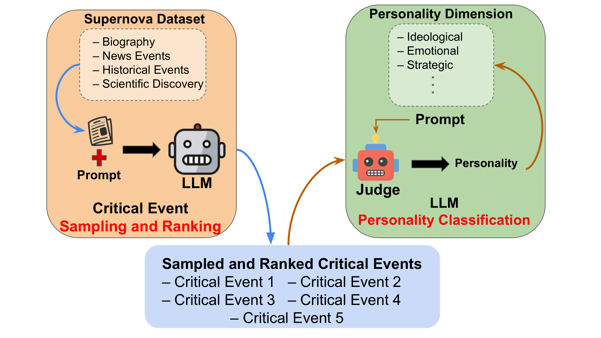

# Supernova Event Dataset: Official Code Repository
[](https://arxiv.org/abs/2506.12189)
[](https://huggingface.co/datasets/SupernovaEvent/SupernovaEventDataset)
[](https://opensource.org/licenses/MIT)
[](https://www.python.org/downloads/)

Official repository for the research paper **"Supernova Event Dataset: Interpreting Large Language Model's Personality through Critical Event Analysis"** by

[Pranav Agarwal](https://pranaval.github.io/)<sup>1</sup> · [Ioana Ciucă](https://www.iciuca.com/)<sup>2</sup>

<sup>1</sup>Mila, Quebec AI Institute · <sup>2</sup>Stanford University

[📄 Paper](https://arxiv.org/pdf/2506.12189) | [🌐 Project Page](https://supernova-event.ai/) | [🤗 Dataset](https://huggingface.co/datasets/SupernovaEvent/SupernovaEventDataset) | [📊 Demo](https://www.supernova-event.ai/#your-story)

<p align="center">
  
</p>

##  Overview

In this work, we interpret the personality traits of Large Language Models (LLMs) using our proposed Supernova Event Dataset, which includes Wikipedia articles consisting of historical events, biographies, news events, and scientific discoveries. We benchmark models based on their identification and ranking of key life or discovery events, a complex task requiring causal reasoning. A second LLM acts as a judge to infer each model’s personality based on its event selection and interpretation. Our analysis show distinct traits, like emotional reasoning in Orca 2 and analytical framing in Qwen 2.5, enhancing interpretability and trust.

## Quick Start

### Prerequisites

- Python 3.8 or higher
- API keys for OpenAI, Anthropic, and/or Gemini (depending on models used)

### Installation

```bash
# Clone the repository
git clone https://github.com/pranaval/supernova-event-dataset.git
cd supernova-event-dataset

# Create virtual environment
python3.8 -m venv myenv
source myenv/bin/activate  # On Windows: myenv\Scripts\activate

# Install dependencies
pip install -r requirements.txt
```

### Configuration

Create a `.env` file in the root directory:

```bash
OPENAI_API_KEY=your_openai_key_here
ANTHROPIC_API_KEY=your_anthropic_key_here
GOOGLE_API_KEY=your_google_key_here
```

## Dataset

The Supernova Event Dataset contains 592 carefully curated Wikipedia articles:

| Domain | Count | Description |
|--------|--------|-------------|
| 🎭 **Biographies** | 192 | Life stories of influential figures |
| 📰 **News Events** | 200 | Major contemporary events |
| 📚 **Historical Events** | 200 | Significant historical occurrences |
| 🔬 **Scientific Discoveries** | 25* | Comprehensive discovery narratives |

*Scientific discoveries use Google Gemini 2.5 Pro with Deep Research for comprehensive articles

### Download Dataset

```bash
# Extract all datasets
tar -zxvf Dataset/biographies.tar.xz
tar -zxvf Dataset/historical-events.tar.xz
tar -zxvf Dataset/major-news-events.tar.xz
```

##  Usage

### 1️⃣ Extract Critical Events

Run event extraction for each domain:

```bash
# Biographies
python biography_dataset.py --model orca-2

# Historical Events  
python history_dataset.py --model phi-4

# News Events
python news_dataset.py --model orca-2

# Movie Scripts (optional additional domain)
python movies_dataset.py --model qwen-2.5
```

### 2️⃣ Analyze Model Personality

Consolidate results and extract personality patterns:

```bash
# Generate personality analysis for all models
python extract_personality.py

```

### 3️⃣ Visualize Results

Create personality visualizations:

```bash
# Generate radar plots and semantic space mapping
python plot_personality.py

```
## Citation

If you find our work useful, please cite:

```bibtex
@article{agarwal2025supernova,
  title={Supernova Event Dataset: Interpreting Large Language Model's Personality through Critical Event Analysis},
  author={Agarwal, Pranav and Ciucă, Ioana},
  journal={arXiv preprint arXiv:2506.12189},
  year={2025}
}
```

##  License

This project is licensed under the MIT License - see the [LICENSE](LICENSE) file for details.

## Acknowledgments

- Wikipedia for article content
- Model providers (OpenAI, Anthropic, Google) for API access
- [Fundamental of Ollama](https://github.com/pdichone/ollama-fundamentals) 
